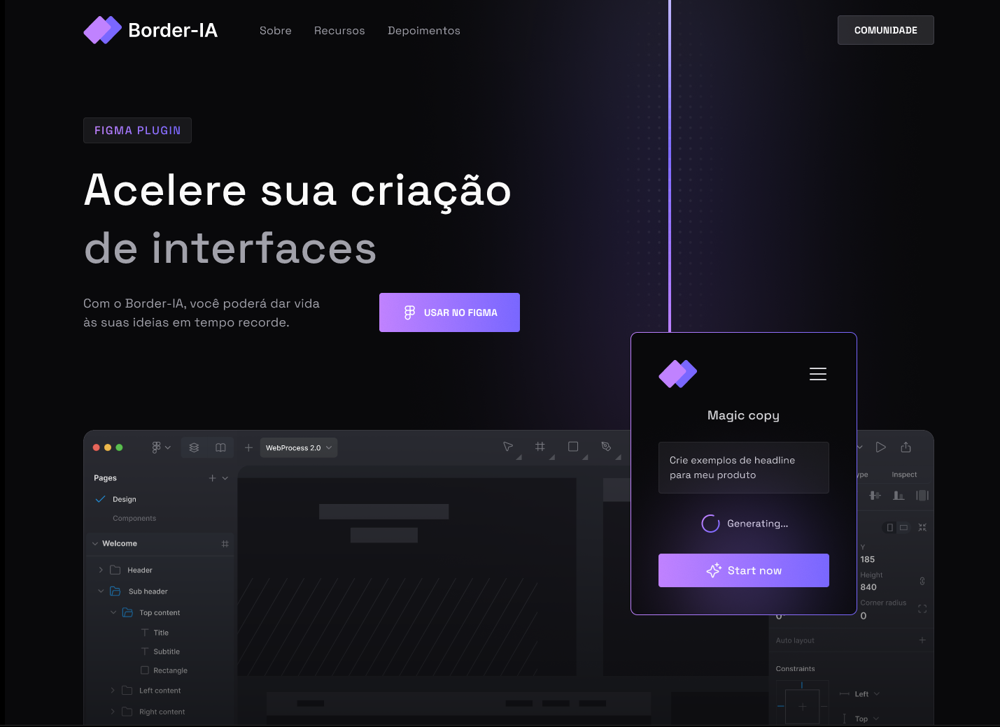

<h1 align="center">Border-IA<h1/>



## Descrição:
Uma landing page de um plugin de Figma chamado Border-IA, que utiliza inteligência artificial para ajudar designers a projetarem interfaces com mais rapidez.

## Tecnologias
- Next
- Tailwind

## Pré-requisitos
- Você instalou a versão mais recente do <a href="https://nodejs.org/">Node</a>;
- Tenha o <a href="https://git-scm.com/">GIT</a> instalado em sua máquina;
- Tenha o <a href="https://code.visualstudio.com/">Visual Studio Code</a> ou outra IDE instalado em sua máquina;


## Instalado a aplicação
```sh
//Clone o repositório
git clone https://github.com/joaotuliojt/border-ia

//Acesse o arquivo clonado
cd border-ia

//Instale as dependências
npm install ou yarn

//Rode a aplicação localmente
npm run dev ou yarn dev

//Clique no link que surgir em seu terminal
```

## Links
-  <a href="https://www.figma.com/community/file/1255897974007201592/Border-IA---WebJourney" target="_blank">Figma</a>
-  <a href="https://border-ia.vercel.app/" target="_blank">Preview</a>

## Créditos da UI:
A UI foi construída pelo <a href="https://www.linkedin.com/in/jonas-milan-8b68b3b2/"> Jonas Milan </a>
___
<p align="center">
  
<p/>
<p align="center"> Desenvolvimento por <a href="https://joaotul.io">joaotul.io</a></p>
